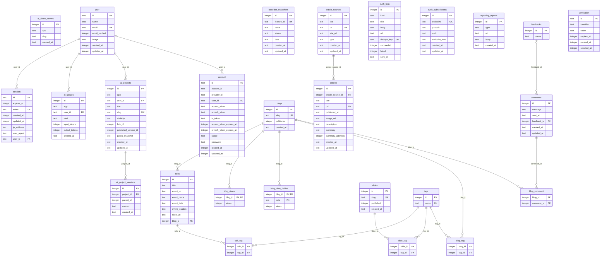

# @repo/database

k8o のデータベース関連コードをまとめたパッケージです。

このパッケージでは、主に以下を管理します。

- Drizzle ORM のスキーマ定義
- Turso / libSQL への接続
- マイグレーション
- Better Auth 用の DB スキーマ
- Storybook 向けのモック DB エクスポート

## ディレクトリ構成

変化しやすいテーブル一覧ではなく、責務単位で構成を把握できるようにしています。

```txt
packages/database/
├── src/
│   ├── db.ts           # アプリケーション用の DB エクスポート
│   ├── auth.ts         # Better Auth 関連のエクスポート
│   ├── utils.ts        # DB 操作の補助ユーティリティ
│   ├── schema/         # Drizzle のスキーマ定義
│   └── __mocks__/      # Storybook / テスト向けのモック実装
├── migrations/         # drizzle-kit が生成するマイグレーション
├── drizzle.config.ts   # drizzle-kit 設定
└── package.json
```

## エクスポート

- `@repo/database`
  - 通常実行時は `src/db.ts`
  - `storybook` 条件では `src/__mocks__/db.ts`
- `@repo/database/auth`
  - Better Auth 用のエクスポート

詳細は [`package.json`](./package.json) を参照してください。

## 主要コマンド

リポジトリルートで実行します。

```bash
pnpm run -F @repo/database dev
pnpm run -F @repo/database generate
pnpm run -F @repo/database generate:custom
pnpm run -F @repo/database migrate
pnpm run -F @repo/database studio
pnpm run -F @repo/database export:schema
pnpm run -F @repo/database build:erd
```

## ER 図

`src/schema` から `pnpm run -F @repo/database build:erd` で自動生成しています（手書きではありません）。

<!-- ERD:START -->
<!-- 自動生成: `pnpm build:erd` で再生成。手で編集しない。 -->


<!-- ERD:END -->

## 運用方針

- スキーマ変更は `src/schema/` を更新し、必要に応じてマイグレーションを生成します。
- テーブル定義やカラム一覧を README に手書きしません。下の ER 図セクションは `build:erd` による自動生成で、マーカー間を直接編集しません。
- 現在の正確な構造は `src/schema/` と `migrations/` を一次情報とします。
- スキーマを変更したら `pnpm run -F @repo/database build:erd` で README の ER 図を更新します。
